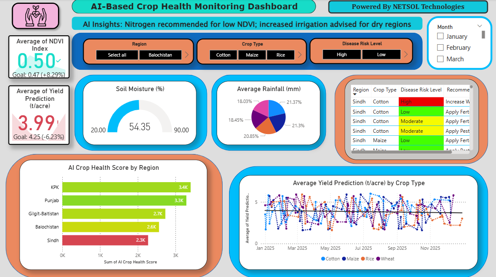
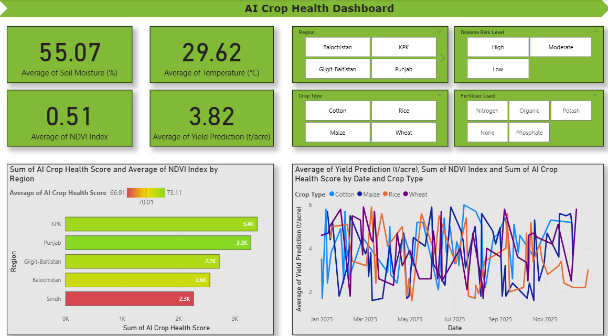
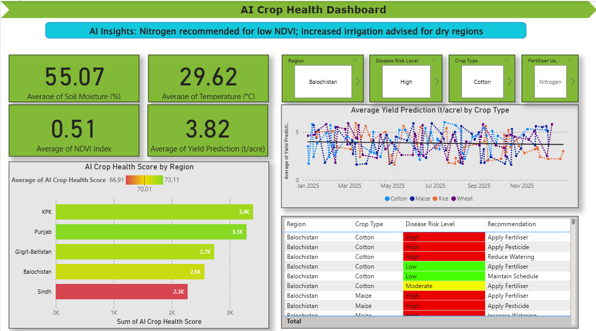

# Smart AgriTech: AI Crop Health & Yield Dashboard

**Author:** Sahil Faraz | **Date:** November 2025

> **Academic Disclaimer:** This repository contains an academic project for the **Pearson B-TEC HND in Digital Technologies (Cybersecurity) - Unit 21: Emerging Technologies** module. It is strictly for portfolio and demonstration purposes. Other students may not use or copy this material for their own academic submissions.
---
## 📖 About This Project
This repository contains a Power BI dashboard focused on the agricultural sector. It explores how Artificial Intelligence and simulated IoT sensor data can be combined to monitor crop health and predict yields. The primary goal of this project was to design a tool that transitions traditional, reactive farming methods into a proactive, data-driven system.
### Dashboard Overview

> **Note:** You can download the `.pbix` file located in the `Dashboard/` folder to explore the interactive features locally. Visual previews of the dashboard are available in the `Images/` directory.
### [Link to the Dashboard](https://app.powerbi.com/view?r=eyJrIjoiZmIzYjNmZjEtNDAzNC00ZmYzLTliNzktOGJmODg1ODkzNDQwIiwidCI6IjkwZGYzMGEwLTRlNDMtNGE1YS05NDE3LWY0MTNlNTcwNWY2MCIsImMiOjl9)
---
## ✨ Core Functionalities
*   **Environmental Tracking:** Monitors crucial field metrics in real-time, including Temperature, Average Soil Moisture, and the NDVI (Normalized Difference Vegetation Index).
*   **Yield Forecasting:** Utilizes machine learning models to project future crop yields (measured in tons/acre) and spot potential health risks before they impact the harvest.
*   **Actionable AI Prompts:** Generates specific, automated farming recommendations based on data inputs (for example, advising the application of Nitrogen when NDVI is low, or adjusting irrigation schedules for dry zones).
*   **Precision Agriculture:** Highlights the strategic business value of minimizing resource waste and promoting sustainable farming techniques.

## 📈 Project Evolution
This dashboard was refined over three distinct stages, incorporating simulated user feedback to improve data transparency and usability:
### **Phase 1 - Foundation:** 
Built the initial visual framework for crop analysis and yield forecasting, establishing the baseline AI metrics.

### **Phase 2 - Validation & Logic:** 
Integrated a data-validation layer to ensure data integrity before analysis. Added a classification system to group crop health into "healthy," "moderate," and "poor" categories based on environmental triggers.

### **Phase 3 - UI/UX Polish:** 
Overhauled the visual layout to improve user navigation and interactivity, making the AI-driven insights much easier for an end-user to interpret.

## 🗂️ Folder Structure
*   `Dashboard/`: Contains all the `.pbix` Power BI files.
*   `Datasets/`: Contains the dataset used to make the Power BI dashboard.
*   `Images/`: Includes screenshots of the dashboard's features and its evolution through the three development phases.

## 💻 Tech Stack
*   **Software:** Microsoft Power BI
*   **Domains:** Data Visualization, Artificial Intelligence, Precision Agriculture, IoT Data Simulation
